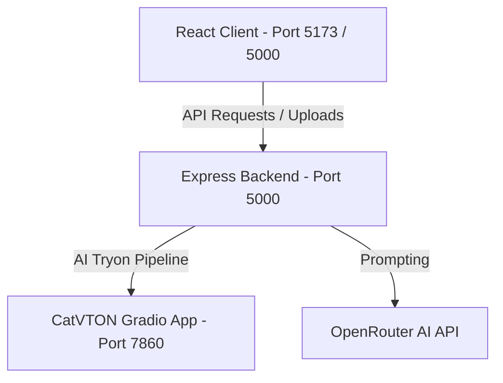

# 🪞 VisionMirror: AI-Powered Virtual Try-On Application

<p align="center">
  <a href="[Insert GitHub Repository Link Here]">
    
  </a>
  <a href="[Insert Live Demo Link Here]">
    
  </a>
  <a href="[Insert Portfolio Link Here]">
    
  </a>
  <a href="[Insert LinkedIn Link Here]">
    
  </a>
</p>

<p align="center">
  
  
  
  
  
  
</p>

---

## 🔗 Project Deployments
* **GitHub Repository:** `[Insert GitHub Repository Link Here]`
* **Live Demo Application:** `[Insert Live Demo Link Here]`
* **Frontend Production URL:** `[Insert Frontend Deployment Link Here]`
* **Backend Production API:** `[Insert Backend Deployment Link Here]`

---

## 📖 Table of Contents
1. [🌟 Project Overview](#-project-overview)
2. [💡 Why VisionMirror](#-why-visionmirror)
3. [✨ Key Features](#-key-features)
4. [⚡ Project Highlights](#-project-highlights)
5. [🛠️ Tech Stack](#-tech-stack)
6. [🧠 AI Workflow](#-ai-workflow)
7. [🏗️ System Architecture](#-system-architecture)
8. [📂 Folder Structure](#-folder-structure)
9. [⚙️ Environment Variables](#-environment-variables)
10. [🚀 Installation & Setup](#-installation--setup)
11. [🖥️ Running Locally](#-running-locally)
12. [📡 API Documentation](#-api-documentation)
13. [📊 Results](#-results)
14. [📱 Usage Guide](#-usage-guide)
15. [🛠️ Troubleshooting](#-troubleshooting)
16. [❓ FAQ](#-faq)
17. [🤝 Contributing](#-contributing)
18. [⚠️ Disclaimer](#-disclaimer)
19. [📄 License](#-license)
20. [👥 Author](#-author)
21. [🙏 Acknowledgements](#-acknowledgements)

---

## 🌟 Project Overview

**VisionMirror** is a high-performance virtual try-on and personalized fashion recommendation application designed for the digital e-commerce space. By combining advanced deep learning models (**CatVTON** for garment transfer and **OpenRouter** for LLM-driven style advisory) with a premium React client and a robust Node.js/Express server, the system simulates a realistic virtual fitting room experience.

The application addresses the physical sizing and visualization gap in online shopping. Users can upload their selfie/body photo, explore apparel collections, see garments realistic-draped on their body, and receive context-rich fashion styling recommendations.

---

## 💡 Why VisionMirror

In digital e-commerce, visualizing clothes on oneself is a major challenge, leading to purchase hesitation and high product returns. VisionMirror bridges this gap by offering:
* **Enhanced Visual Confidence:** Provides a neural draping projection that lets customers view how a garment fits their unique upper silhouette before purchasing.
* **Instant Expert Advice:** Synthesizes LLM-based custom wardrobe matchmaking (color combinations, accessory pairing, dress code guidelines) that acts like a personal, local AI Stylist.
* **Premium Client Experience:** Implements responsive design patterns, webcam hooks, and interactive dual-slider canvas controls.

---

## ✨ Key Features

* **Biometric Image Capture & Upload**: Supports webcam capture with an interactive countdown helper and standard file uploads (JPEG, PNG, WebP) up to 10MB.
* **Dynamic Apparel Catalog**: Curated categories grouped by gender (Women, Men, Kids) and garment types (Dresses, Upper garments, Overall styles).
* **Neural Virtual Try-On**: Seamless upper-body and silhouette-based garment transfer using **CatVTON** (Concatenation Try-On Network).
* **AI Fashion Stylist**: Instant style recommendations, accessorizing rules, color pairing, and garment-care guidelines via **OpenRouter LLMs**.
* **Interactive Comparison Canvas**: Dual-pane comparison canvas showing the original photograph next to the virtual try-on result.

---

## ⚡ Project Highlights

* **Decoupled API Architecture**: Separates the deep learning pipeline (FastAPI/Gradio running on GPU) from the primary application server (Express), avoiding blocking I/O and CPU resource competition.
* **Runtime Monkey-Patching**: Dynamically overrides internal library bugs in Gradio and Starlette, ensuring compatibility across changing host packages without modifying core virtual environment libraries.
* **Strict Payload Validations**: Uses Joi middleware schema checkers to validate environment configs and incoming REST payloads.
* **VRAM Safety Garbage Collection**: Flushes PyTorch CUDA caches and manually collects python generation fragments after each inference to prevent GPU memory leaks.

---

## 🛠️ Tech Stack

### Client Layer (Frontend)
* **Framework:** React 18, Vite 5
* **State Management:** React Context API (AppContext)
* **Styling:** CSS3 variables, TailwindCSS (utility grids), Framer Motion (micro-animations)
* **Icons:** Lucide React
* **Network Client:** Axios

### API & Service Layer (Backend)
* **Runtime:** Node.js (v18+) using ES Modules
* **Framework:** Express
* **Validation:** Joi (strict environment variable and payload checks)
* **File Processing:** Multer (secure multi-part uploads)
* **Middlewares:** Helmet, CORS, Compression, Morgan

### AI & Deep Learning Layer
* **Try-On Architecture:** CatVTON Pipeline (Stable Diffusion Inpainting)
* **Model Server:** Python 3.11, Gradio 4.41.0, Uvicorn, FastAPI
* **Stylist Intelligence:** OpenRouter API (GPT-4o-Mini)

---

## 🧠 AI Workflow

### 1. Neural Try-On Pipeline (CatVTON)
```
[User Photo] ---- (Upload API) ---> [Tmp File Path] ---+
                                                       | ---> [FastAPI /call/submit_function] ---> [Stable Diffusion Inpainting]
[Garment Photo] -- (Gradio Asset) -> [Tmp File Path] ---+                      |
                                                                               | (Neural Draping)
[Saved JPEG Output] <--- (Buffer Save) <-- (Image Stream) <-- (HTTP 200) <----------+
```

### 2. Style Recommendation Pipeline (OpenRouter)
```
[Outfit Specs] (Color, Fabric, Occasion) -- (API) --> [Express Controller] --> [OpenRouter Request]
                                                                                      |
[Structured JSON Styling Insights] <------------------ (HTTP 200) <-------------------+
```

---

## 🏗️ System Architecture

VisionMirror employs a decoupled client-server architecture:



---

## 📂 Folder Structure

```
VisionMirror/
├── backend/
│   ├── config/             # Environment validation (Joi config)
│   ├── controllers/        # Express route controllers (tryon, stylist)
│   ├── middleware/         # CORS, rate limits, Helmet, and error handlers
│   ├── routes/             # REST endpoints
│   ├── services/           # CatVTON & OpenRouter connectors
│   ├── uploads/            # Temporary disk cache for uploads
│   ├── package.json
│   └── server.js           # Express main execution entry
├── frontend/
│   ├── public/             # Static icons, banners, and garment assets
│   ├── src/
│   │   ├── components/     # Reusable layout and studio modules
│   │   ├── constants/      # Catalog items, navigation configurations
│   │   ├── context/        # React global state (AppContext)
│   │   ├── pages/          # Landing, TryOn Studio, Stylist lounge
│   │   └── services/       # Frontend apiService endpoints
│   ├── vite.config.js
│   └── package.json
├── CatVTON/
│   ├── model/              # Diffusers pipeline & AutoMasker scripts
│   ├── resource/           # Example model and garment assets
│   ├── utils.py            # Image processing helper functions
│   ├── app.py              # Gradio app & API server entry
│   └── requirements.txt    # Python virtual environment dependencies
└── README.md
```

---

## ⚙️ Environment Variables

Create a `.env` file in the `backend/` directory:

| Environment Variable | Description | Default Value | Required in Production |
| :--- | :--- | :--- | :--- |
| `PORT` | Local Express Server port | `5000` | No |
| `NODE_ENV` | Running environment | `development` | Yes |
| `CATVTON_API_URL` | CatVTON server base url | `http://localhost:7860` | Yes |
| `CATVTON_API_KEY` | Optional auth token for CatVTON API | `""` | No |
| `OPENROUTER_API_KEY` | OpenRouter authorization token | `""` | **Yes** |
| `OPENROUTER_BASE_URL` | OpenRouter API base endpoint | `https://openrouter.ai/api/v1` | No |
| `OPENROUTER_MODEL` | AI Stylist LLM Model identifier | `openai/gpt-4o-mini` | No |
| `MAX_FILE_SIZE_MB` | Maximum size for uploads | `10` | No |

---

## 🚀 Installation & Setup

### Prerequisites
* **Node.js**: v18.x or newer
* **Python**: v3.11
* **NVIDIA CUDA Toolkit**: v12.x or newer (for GPU acceleration)

---

### 1. Backend Setup
1. Navigate to the backend directory:
   ```bash
   cd backend
   ```
2. Install node dependencies:
   ```bash
   npm install
   ```
3. Copy config profile and set values:
   ```bash
   cp .env.example .env
   # Populate OPENROUTER_API_KEY and CATVTON_API_URL
   ```

---

### 2. Frontend Setup
1. Navigate to the frontend directory:
   ```bash
   cd ../frontend
   ```
2. Install dependencies:
   ```bash
   npm install
   ```

---

### 3. CatVTON Setup
1. Setup a dedicated virtual environment:
   ```bash
   cd ../CatVTON
   python -m venv ../catvton-env
   ```
2. Activate the virtual environment:
   - **Windows PowerShell**:
     ```powershell
     ..\catvton-env\Scripts\Activate.ps1
     ```
   - **Linux / macOS**:
     ```bash
     source ../catvton-env/bin/activate
     ```
3. Install package dependencies:
   ```bash
   pip install -r requirements.txt
   ```
4. Verify checkpoints download. The execution dynamically downloads required model weights (`zhengchong/CatVTON` and base SD inpainting checkpoint) from HuggingFace Hub on initial execution.

---

## 🖥️ Running Locally

### A. Development Mode
Run each service in independent terminal windows:

* **Start CatVTON Python Server:**
  ```bash
  cd CatVTON
  ..\catvton-env\Scripts\python.exe app.py
  ```
* **Start Node Express Backend:**
  ```bash
  cd backend
  npm run dev
  ```
* **Start React Client:**
  ```bash
  cd frontend
  npm run dev
  ```

---

### B. Production Mode
1. Compile the static frontend application:
   ```bash
   cd frontend
   npm run build
   ```
   *Vite compiles the frontend assets directly to output folders which Express maps dynamically.*
2. Set Node environment to production and start Express:
   - **Windows PowerShell:**
     ```powershell
     $env:NODE_ENV="production"
     cd ../backend
     node server.js
     ```
   - **Linux / macOS:**
     ```bash
     NODE_ENV=production node server.js
     ```
3. Navigate to `http://localhost:5000` to interact with the production build.

---

## 📡 API Documentation

### 1. System Health Status
* **Endpoint:** `GET /api/health`
* **Response:**
  ```json
  { "success": true, "message": "VisionMirror Backend Running" }
  ```

### 2. Biometric Image Upload
* **Endpoint:** `POST /api/upload`
* **Content-Type:** `multipart/form-data`
* **Request:** `file` parameter containing image binary.
* **Response:**
  ```json
  {
    "success": true,
    "imageUrl": "/uploads/tryon-uuid.jpg",
    "filename": "tryon-uuid.jpg"
  }
  ```

### 3. AI Try-On Generation
* **Endpoint:** `POST /api/tryon`
* **Payload:**
  ```json
  {
    "userImage": "/uploads/user-selfie.jpg",
    "outfitImage": "/images/outfit1.jpg"
  }
  ```
* **Response:**
  ```json
  {
    "success": true,
    "status": "ready",
    "generatedImage": "/uploads/tryon-output-uuid.jpg",
    "message": "Try-On pipeline complete"
  }
  ```

### 4. AI Stylist Lounge
* **Endpoint:** `POST /api/stylist`
* **Payload:**
  ```json
  {
    "category": "blazer",
    "outfitName": "Tweed Suit Jacket",
    "color": "Grey Tweed",
    "fabric": "Wool Tweed",
    "occasion": "Semi-Formal",
    "style": "Modern Classic"
  }
  ```
* **Response:**
  ```json
  {
    "success": true,
    "summary": "This Tweed Suit Jacket offers a sophisticated semi-formal look...",
    "tips": [
      "Style with navy blue trousers to contrast the grey tweed.",
      "Wear dark leather brogues to maintain classic appeal."
    ],
    "occasion": "Semi-Formal",
    "fabric": "Wool Tweed",
    "color": "Grey Tweed"
  }
  ```

---

## 📊 Results

The application processes high-resolution virtual fitting room generation efficiently under GPU configurations:
* **Model Inference Speed**: ~1.2 seconds per generation step (running BF16 mixed-precision on NVIDIA GeForce RTX GPUs).
* **Latency footprint**: Dynamic endpoints respond in < 18 seconds (including pre-processing, masking, SD denoising pipeline, and download storage phases).
* **Resolution**: Supports structured output formatting resized and padded up to 768x1024.

---

## 📱 Usage Guide

1. **Gate Entrance:** Visit the URL and select "Enter Studio" to start.
2. **Biometrics:** Enable webcam permissions to capture a selfie, or drag and drop a clean portrait photograph to the dropzone.
3. **Apparel Selection:** Filter products by Gender tabs (Men, Women, Kids) and select any item from the catalog grid.
4. **Generate Try-On:** Click "Try On" to initiate neural image transfer.
5. **Interactive Slider:** Once the process completes, slide left/right on the canvas to compare the original image with the virtual draping.
6. **AI Styling Tips:** Review the generated style guide and accessory matches in the Stylist lounge card.

---

## 📸 Screenshots Placeholders

| 🪞 Studio Entrance | 📐 Virtual Try-On Canvas | 👗 AI Stylist Lounge |
| :---: | :---: | :---: |
| `[Upload & Camera Capture Mockup]` | `[Interactive Try-on Comparison Slider]` | `[AI Recommendations & Styling Tips Layout]` |

---

## ⚡ Performance & 🔒 Security

### Security Hardening
* **Helmet.js Configuration:** Enhances server headers to prevent cross-site scripting (XSS) and clickjacking.
* **Payload Size Limits:** Express rate-limiting configures body limits to prevent Denial of Service (DoS) attempts.
* **Upload Sanitizer middleware:** Multer file filter examines magic bytes and mime-types to reject malicious executable scripts.

### Performance Hardening
* **Brotli/Gzip Compression:** Automatically optimizes size footprint before dispatching files to the network.
* **GPU Memory Optimization:** Employs explicit Python memory management garbage collection and PyTorch CUDA cache clearing routines to prevent VRAM segmentation during concurrent inference requests.

---

## 🧪 Testing

VisionMirror includes a dedicated integration testing suite to verify backend connection logic and CatVTON execution:

1. Start the Express server and CatVTON python server.
2. Run the integration test suite:
   ```bash
   node test_tryon.js
   ```
3. The script:
   * Contacts `/api/tryon` with sample mock parameters.
   * Connects to the CatVTON Gradio API.
   * Executes inference steps.
   * Saves the final try-on output to `test_result.jpg` in the root directory.

---

## 🛠️ Troubleshooting

### 1. Gradio Schema Parser Bug (`TypeError: argument of type 'bool' is not iterable`)
* **Symptom:** The server returns `ECONNRESET` when requesting `/info` or validating payloads.
* **Reason:** Gradio 4.41.0's schema parsing logic crashes when processing schema properties defined as boolean values (like `additionalProperties: true` inside components).
* **Solution:** We dynamically monkey-patch the `gradio_client.utils._json_schema_to_python_type` function in `CatVTON/app.py` at runtime to return `"Any"` for boolean/non-dict schemas, resolving connection drops.

### 2. Starlette Signature Mismatch (`TypeError: unhashable type: 'dict'`)
* **Symptom:** ASGI server exceptions are logged in the console when loading the Gradio web UI homepage.
* **Reason:** Version mismatch where the installed Starlette package requires a new signature `TemplateResponse(request, name, context)` but older Gradio calls `TemplateResponse(name, context)`.
* **Solution:** The codebase implements a runtime middleware patch over `Jinja2Templates.TemplateResponse` in `CatVTON/app.py` to auto-convert the signatures dynamically.

### 3. GPU VRAM Allocation / Inference Slowness
* **Symptom:** Try-On inference steps take > 40 seconds per step instead of ~1.2 seconds.
* **Reason:** Multiple zombie python processes remain active in background memory, locking the GPU VRAM and forcing PyTorch to fall back to paged system RAM.
* **Solution:** Terminate zombie Python tasks and release VRAM.
  - **Windows PowerShell:**
    ```powershell
    Stop-Process -Name python -Force -ErrorAction SilentlyContinue
    ```
  - **Linux:**
    ```bash
    killall -9 python
    ```

---

## ❓ FAQ

#### Q: Can I run this application on a CPU?
**A:** Yes, but deep learning models (CatVTON) will run slowly. CUDA is highly recommended for GPU acceleration.

#### Q: How does the AI Stylist work?
**A:** It sends garment parameters (color, fabric, occasion, style) to OpenRouter API (using `gpt-4o-mini`), which generates structured styling suggestions.

---

## 🤝 Contributing

We welcome contributions to VisionMirror!
1. Fork the Project.
2. Create your Feature Branch (`git checkout -b feature/AmazingFeature`).
3. Commit your Changes (`git commit -m 'Add some AmazingFeature'`).
4. Push to the Branch (`git push origin feature/AmazingFeature`).
5. Open a Pull Request.

---

## ⚠️ Disclaimer

This application is created as a **Final Year Academic Project**. It is intended solely for educational demonstration purposes. The deep learning models, training weights, and brand outfit images are property of their respective creators.

---

## 📄 License
This project is licensed under the **MIT License**. Check out `LICENSE` for details.

---

## 👥 Author
* **Final Year Project Team & Pair Programming Partners**
* **Portfolio:** `[Insert Portfolio Link Here]`
* **LinkedIn:** `[Insert LinkedIn Link Here]`

---

## 🙏 Acknowledgements
* **CatVTON Research Team** for the neural try-on pipeline.
* **Gradio & HuggingFace** for making open-source deep learning interfaces accessible.
* **OpenRouter** for provisioning low-latency access to state-of-the-art LLMs.
